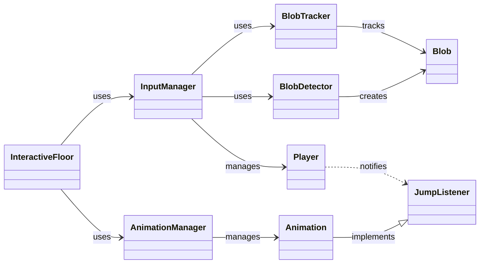

# Interactive Floor System

[](https://opensource.org/licenses/MIT)
[](https://www.oracle.com/java/technologies/javase/jdk17-archive-downloads.html)
[](https://processing.org/)
[](https://github.com/hakmesyo/OJL.git)

An interactive floor system that uses infrared camera tracking for creating immersive installations and interactive experiences. The system detects players using blob detection algorithms and creates real-time visual responses to their movements.


## 🌟 Features

- **Real-time Player Detection**
  - Infrared camera tracking
  - Custom blob detection algorithm
  - Multi-player support
  - Jump detection

- **Extensible Animation System**
  - Plugin-based architecture
  - Multiple animation effects
  - Real-time visual feedback
  - Custom event system

- **Optimized Performance**
  - Efficient blob tracking
  - Real-time processing
  - Memory-efficient design

## 🔧 System Requirements

- Java 17 (recommended and tested version)
- Processing 3.3.7
- Webcam with infrared capabilities
- Projector for display
- Minimum resolution: 640x480
- Recommended CPU: Intel i5 or equivalent

### Linux Users Additional Requirements
For Linux systems, install these libraries:
```bash
sudo apt-get update
sudo apt-get install libgluegen-rt-java libjogamp-all-platforms
```

## 📋 Installation

### Standard Installation
1. **Clone the repository**
```bash
git clone https://github.com/hakmesyo/interactive-floor.git
cd interactive-floor
```

2. **Install dependencies**
```bash
mvn install
```

3. **Configure your setup**
```bash
cp config.example.json config.json
# Edit configuration file with your settings
```

### Linux Installation Steps
1. Set JAVA_HOME to JDK 17:
```bash
export JAVA_HOME=/path/to/jdk17
```

2. Follow the standard installation steps above

### Docker Support (Build Verification Only)
Note: Docker is provided only for build verification. Camera and display features require direct installation.

1. Build Docker image:
```bash
docker build -t interactive-floor .
```

2. Run container:
```bash
docker run interactive-floor
```

## 🚀 Quick Start

```java
public class SimpleExample {
    public static void main(String[] args) {
        InteractiveFloor floor = new InteractiveFloor();
        floor.setup();
        
        // Register your animation
        floor.getAnimationManager().registerAnimation("particles", new ParticleAnimation());
        
        // Start the system
        floor.start();
    }
}
```

## 🏗 Architecture

The system is built using a modular architecture that separates concerns and allows for easy extension.



## 📖 Documentation

Detailed documentation is available in the [docs](docs/) directory:
- [Setup Guide](docs/setup.md)
- [Architecture Overview](docs/architecture.md)
- [Animation System](docs/animations.md)
- [API Reference](docs/api.md)

## 🎨 Creating Custom Animations

```java
public class CustomAnimation implements Animation {
    @Override
    public void onPlayerUpdate(Player player) {
        // Your animation logic here
    }
    
    @Override
    public void draw(PApplet app) {
        // Your drawing code here
    }
}
```

## 🔬 Research Applications

This system has potential applications in various research areas:
- Human-Computer Interaction
- Interactive Art Installations
- Movement Analysis
- Educational Games
- Physical Therapy and Rehabilitation

## 📚 Citation

If you use this project in your research, please cite:

```bibtex
@software{interactive_floor_2024,
  author = {Your Name},
  title = {Interactive Floor System},
  year = {2024},
  publisher = {GitHub},
  url = {https://github.com/hakmesyo/interactive-floor}
}
```

## 🤝 Contributing

Contributions are welcome! Please read our [Contributing Guidelines](docs/contributing.md) for details on our code of conduct and the process for submitting pull requests.

## 📄 License

This project is licensed under the MIT License - see the [LICENSE](docs/license.md) file for details.

## 🙏 Acknowledgements

- Processing Foundation for their excellent framework
- The open-source community for various inspirations
- All contributors who have helped shape this project

## 📬 Contact

- Your Name - [hakmesyo@gmail.com](mailto:hakmesyo@gmail.com)
- Your Name - [musa.atas@siirt.edu.tr](mailto:musa.atas@siirt.edu.tr)
- Project Link: [https://github.com/hakmesyo/interactive-floor](https://github.com/hakmesyo/interactive-floor)
