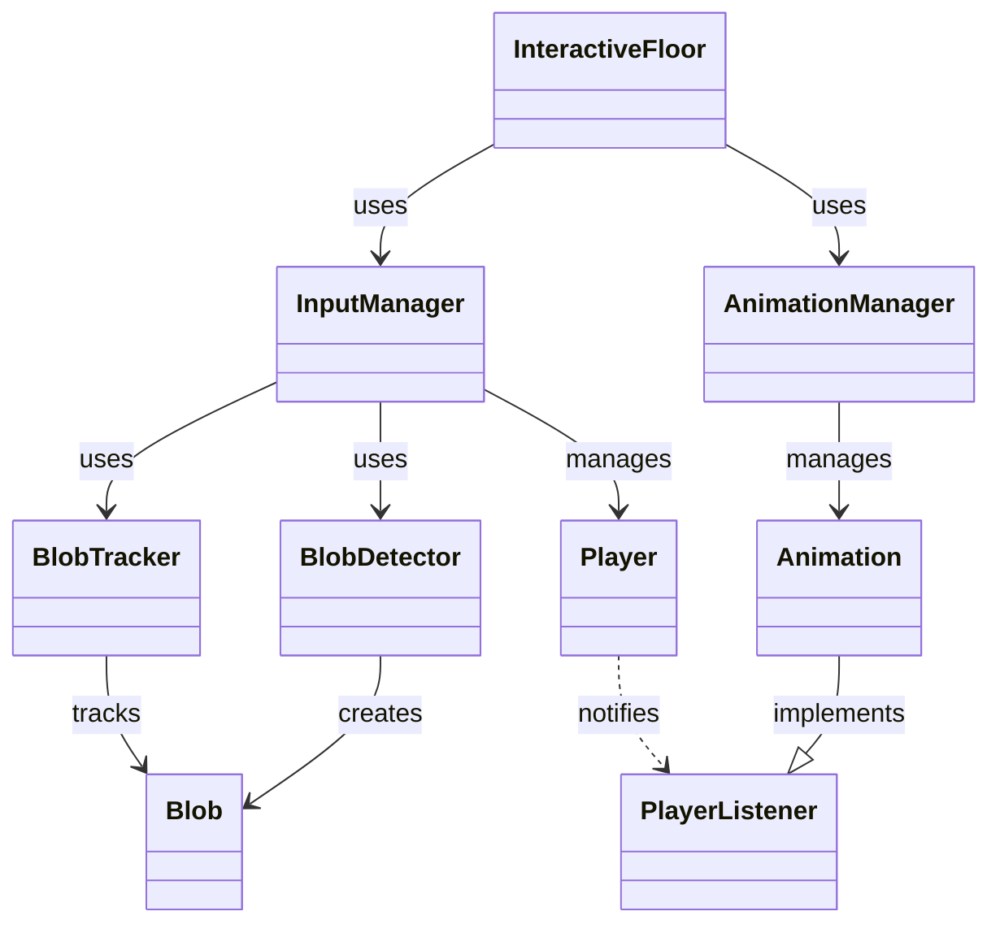

# Interactive Floor System Architecture Guide

## System Overview

The Interactive Floor System is built on a modular, event-driven architecture that separates concerns between input processing, motion tracking, and visual output. The system consists of four main subsystems:

1. Input Processing
2. Blob Detection & Tracking
3. Player Management
4. Animation System



## Core Components

### 1. InteractiveFloor
The main controller class that coordinates all subsystems:
- Initializes and manages core components
- Handles main processing loop
- Manages debug mode and system state
- Coordinates input and animation updates

Key responsibilities:
```java
public class InteractiveFloor extends PApplet {
    private InputManager inputManager;
    private AnimationManager animationManager;
    // Manages core system loop and coordination
}
```

### 2. Input Processing

#### InputManager
Handles camera input and player detection:
- Manages webcam interface
- Coordinates blob detection and tracking
- Maintains player states
- Maps camera coordinates to screen space

```java
public class InputManager {
    private Webcam webcam;
    private BlobDetector blobDetector;
    private BlobTracker blobTracker;
    // Processes input and manages player tracking
}
```

### 3. Motion Detection

#### BlobDetector
Implements computer vision algorithms:
- Processes IR camera input
- Applies threshold-based detection
- Implements flood fill algorithm
- Filters noise and invalid detections

Key features:
```java
public class BlobDetector {
    private static final int MIN_BLOB_MASS = 100;
    private static final int MAX_BLOB_MASS = 5000;
    // Implements blob detection algorithms
}
```

#### BlobTracker
Maintains blob identity across frames:
- Tracks blobs between frames
- Assigns unique IDs to blobs
- Handles blob persistence
- Manages blob timeouts

### 4. Player Management

#### Player
Represents a tracked user in the system:
- Maintains position and velocity
- Tracks movement states
- Implements movement patterns
- Handles player events

States and Types:
```java
public enum PlayerState {
    STATIC, WALKING, RUNNING, JUMPING, AIRBORNE
}

public enum MovementType {
    LINEAR, CIRCULAR, ERRATIC
}
```

### 5. Animation System

#### AnimationManager
Coordinates visual effects:
- Manages multiple animations
- Handles animation transitions
- Processes player interactions
- Controls sound effects

Interface definition:
```java
public interface Animation {
    void update(PApplet app, Player player);
    void draw(PApplet app);
    void reset();
    String getName();
}
```

Implemented animations:
- ParticleAnimation
- FireAnimation
- WaterAnimation
- LogoAnimation

## Event System

### Event Flow
1. Camera Input → Blob Detection
2. Blob Tracking → Player Updates
3. Player Events → Animation Responses

### Listener Interfaces
```java
public interface PlayerListener {
    void onPlayerMove(Player player, float x, float y, float vx, float vy);
    void onPlayerJump(Player player);
}

public interface PlayerStateListener {
    void onPlayerStateChange(Player player, PlayerState newState);
}
```

## Performance Considerations

### Optimization Strategies
1. Efficient Blob Detection
   - Optimized flood fill algorithm
   - Threshold-based filtering
   - Memory-efficient data structures

2. Player Tracking
   - Predictive tracking algorithms
   - Efficient state management
   - Movement pattern recognition

3. Animation Performance
   - Particle system optimization
   - Effect pooling
   - Frame rate management

## Memory Management

### Resource Handling
1. Camera Resources
   - Proper webcam initialization/cleanup
   - Image buffer management
   - Memory-mapped I/O

2. Animation Resources
   - Particle pooling
   - Texture caching
   - Effect recycling

## Threading Model

### Main Thread
- Processing sketch loop
- Input processing
- Animation updates
- Display rendering

### Background Operations
- Sound loading
- Resource cleanup
- Long-running calculations

## Debug System

### DebugUtils
Provides development and testing tools:
- Performance monitoring
- Visual debugging
- State inspection
- System statistics

## Configuration System

### Runtime Configuration
- Camera settings
- Detection parameters
- Animation properties
- Sound settings

### Persistent Settings
- System preferences
- Calibration data
- Performance options

## Extension Points

### Custom Animations
```java
public class CustomAnimation implements Animation {
    @Override
    public void update(PApplet app, Player player) {
        // Custom animation logic
    }
    
    @Override
    public void draw(PApplet app) {
        // Custom drawing code
    }
}
```

### Custom Event Handlers
```java
public class CustomEventHandler implements PlayerListener {
    @Override
    public void onPlayerMove(Player player, float x, float y, float vx, float vy) {
        // Custom movement handling
    }
}
```

## Future Considerations

### Planned Improvements
1. Multi-camera support
2. Advanced gesture recognition
3. Network synchronization
4. Machine learning integration

### Scalability
1. Distributed processing
2. Load balancing
3. Resource optimization
4. Performance monitoring

## Security Considerations

### Input Validation
- Camera data verification
- Configuration validation
- Resource access control

### Error Handling
- Graceful degradation
- Error recovery
- System state preservation

## Coding Standards

### Best Practices
1. Clear component responsibilities
2. Consistent error handling
3. Comprehensive documentation
4. Performance optimization
5. Memory management
